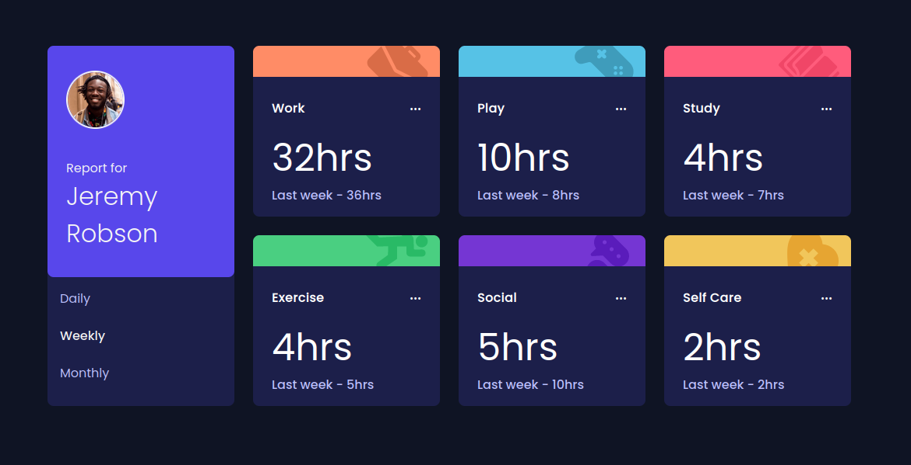
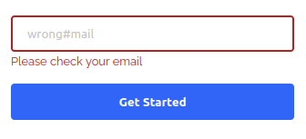
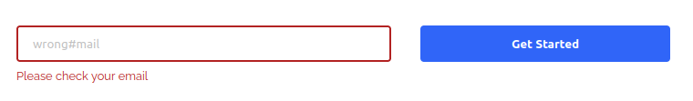

Fylo Landing Page
=================

<!-- TODO: Add screenshot 

-->

## Description

This is a front-end coding challenge from [Frontend Mentor](https://www.frontendmentor.io/).
The goal is to clone a landing page.
This is a pure HTML and CSS project, including the user notifications for input validation, which for me was the most interesting part of this project.

The layout is mobile responsive, with a single breakpoint at 375px.
The page was constructed using a mobile first approach, which overall felt much straightforward to develop than starting with the desktop layout and then fit in the content in smaller screens.

## Source code

A live version of this project is available [here](https://jovial-cascaron-eb425a.netlify.app/).

Check the project [on my GitHub](https://github.com/cdpaiva/frontend-mentor/tree/main/fylo-landing-page-with-two-column-layout-master).

Feel free to change it, test it or break it.
Feedback and ideas are always very much appreciated.

## Initial Design

The project layout is offered by Frontend Mentor.
When we download the initial files, we receive the design images, along with a style-guide (color, typography and targeted screen sizes) and the SVGs/images used in the entire page.

## Going Mobile First

Mobile website layouts tend to be much more simple than their desktop counterparts.
The smaller screen sizes don't give much room to be very inventive, and the general page structure tends to look like a raw HTML document, where elements are stacked in a single large column.
Adding typography, spacing, images, icons and background is already a good start to a mobile layout that is also guaranteed to be responsive in all screens.
Of course there are singular aspects of mobile design (navigation menus for example), but the mobile design feels almost like the perfect starting point for a desktop layout.
There is not much to be trimmed out and the core website structure can be reused.
I think this is true even to very complex desktop pages, because the mobile version usually contains the basic building blocks that will be needed to the desktop version.

One big realization (for me at least) of responsive design is that a web page without any CSS at all is already fully responsive.
The restrictions we impose with CSS are what will cause elements to overflow, loose position and break our interface.
Keeping our CSS simple is a good way to build responsive websites easily.

By starting with the simpler layout, we can make sure that we are only adding necessary code to add complexity on top of what we have.
To me, starting with the desktop version results in a page with complex styling elements, that need another layer of complexity to turn them back to a simpler layout.


## Pure HTML/CSS input validation notification

CSS provides us a very useful set of [pseudo-classes](https://developer.mozilla.org/en-US/docs/Web/CSS/Pseudo-classes#the_input_pseudo-classes) to represent input validation.
The task in this project is to display a custom e-mail message to the user if the value inserted in the `input:email` is invalid.
While we can directly change the style of the input with the `:invalid` pseudo-class, this is not enough to display the message, because we cannot add `::before` or `::after` pseudo-elements to an input.
Pseudo-elements need a container element to be defined in.
As an input element cannot contain other elements, they won't accept the pseudo-elements.

The solution is to create a sibling span element and to add a pseudo-element to it.
Then we can use a [combinator](https://developer.mozilla.org/en-US/docs/Web/CSS/Adjacent_sibling_combinator) to display content in the span _only when the input is invalid_.
According to the mdn web docs:
> The adjacent sibling combinator (+) separates two selectors and matches the second element only if it immediately follows the first element, and both are children of the same parent element.

The code would be:

```css
input:invalid + span::before {
    content: 'Please check your email';
    color: firebrick;
}
```

This was enough for the mobile version, where the e-mail input and the submit button are stacked.



The problem is that in the desktop version, the input and the button are in the same flex row.
Following the current CSS rules, the message would be positioned between the input and the button, breaking the layout.
The message must be displayed below the input, so it needs to be removed from the flexbox position.
In this case the `span` was changed, to have `position: absolute`. 
I had to set the parent container (which is the flexbox container for the input and the button) with `position: relative`, so that the span would be positioned relative to it and then seed the appropriate `top` and `left` attributes to the span.
The desktop layout for the input looks like this:



The code for the desktop version was:
```scss
@media(min-width:$desktop) {
    .flex-container {
        // display: flex; --> set in the mobile layout
        flex-direction: row;
        position: relative;

        input:invalid + span::before {
            position: absolute;
            top: 3rem;  //manually adjusted
            left: 0;
        }
    }
}
```
As a last detail, the input borders also had to change colors depending on the input.
To change it correctly, it is important to remove the default `outline` that all browsers display when the element is focused, otherwise we would end up with a strange two borders effect.
To do so is as simple as:

```scss
.input {
    border: 2px solid $lightGray;

    &:focus {
        outline: 0;
        border: 2px solid blue;
    }

    &:invalid {
        border: 2px solid firebrick;
    }
}
```