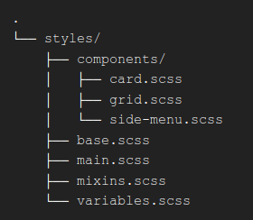

React Time Tracking Dashboard
=============================

## Description

This is a front-end coding challenge from [Frontend Mentor](https://www.frontendmentor.io/).
The goal is to clone a dashboard, that presents information from a time tracker app to a user.
The information is retrieved from a JSON file.
There are six categories, each one with a custom top label.
A user profile is displayed to the left, along with the options to present the hours tracked in different periods of time.
This project is mostly a CSS practice, so I took the chance to apply SASS in it.
The layout is mobile responsive, with a breakpoint at 375px, where the grid changes into a single column.

## Source code

A live version of this project is available [here](https://lucky-nougat-bbe19b.netlify.app/).

Check the project [on my GitHub](https://github.com/cdpaiva/time-tracking-dashboard).

Feel free to change it, test it or break it.
Feedback and ideas are always very much appreciated.

## Initial Design

The project layout is offered by Frontend Mentor.
When we download the initial files, we recieve the design images, along with a style-guide (color, typography and targeted screen sizes) and the SVGs/images used in the entire page.
This speeds things up a lot, since acquiring resources and browsing ideas to inspire a desing usually take me quite some time.

Comparing my final product to the given layout, I'm satisfied with the result.
I tried to stick to the design all times, except for the rounded top border in each dark blue card.
Personally, I believe a regular flat top bottom there creates a better composition.

## SASS

I used [SASS](https://sass-lang.com/) to generate the CSS.
SASS is a CSS preprocessor that has been around for over 15 years.
It offers really neat features to write CSS easier.
The features I used in this project were nesting, mixins and having multiple files for each component.

I aimed to have a good file structure for the SCSS files, that could also be used efficiently in bigger projects.
Wait, I said I'd use SASS, but now I'm talking about SCSS files?
Well, what I really used is SCSS, which is just another syntatic flavor of SASS, that supersets common CSS.
Both SASS and SCSS will compile to the same CSS code.
SASS itself uses an identation syntax that felt to me I would take a bit of extra time to learn, so I avoided it.
Writting SCSS is the same as writting common CSS syntax, so we can simply write our style with extended functionality.

The SCSS file structure was:

* Each component has its own file.
* The _main.scss_ concentrates all other files with import directives.
* Common initial style rules are in _base.scss_, like `box-sizing: border box`.
* Mixins and variables also have their own files. First, I thought a variables file would be too much, but it really helps to reinforce reusability of variables, which in turn will impact in a better color schema and consistent design over the application.
* With SASS we can also encapsulate each component style in a single file, a bit kind of what is done in modern JS frameworks.
Every tool that avoids 500+ lines CSS files in very welcome!

## React and styled components

Since the goal was to use SASS, I just used React to change the different periods of time that could be selected in the side menu.
I felt that completely isolating the style from React wasn't a good choice.
The cards are dinamically imported, and a good application should be able to handle different categories to track later, and dinamically style them.
With only SASS, it seemed harder to have dynamic content created, but it could be done using functions.
As I chose not to go that way, I ended up creating a single class to each card.
This resulted in a code that is not much flexible and also not DRY.
My idea is to use Styled Components to recreate this dashboard and then check how easier it was.