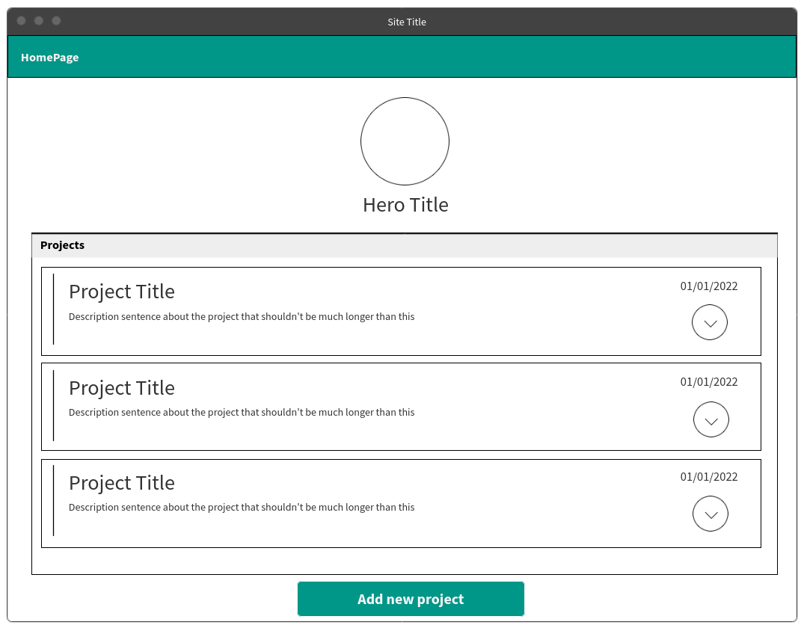
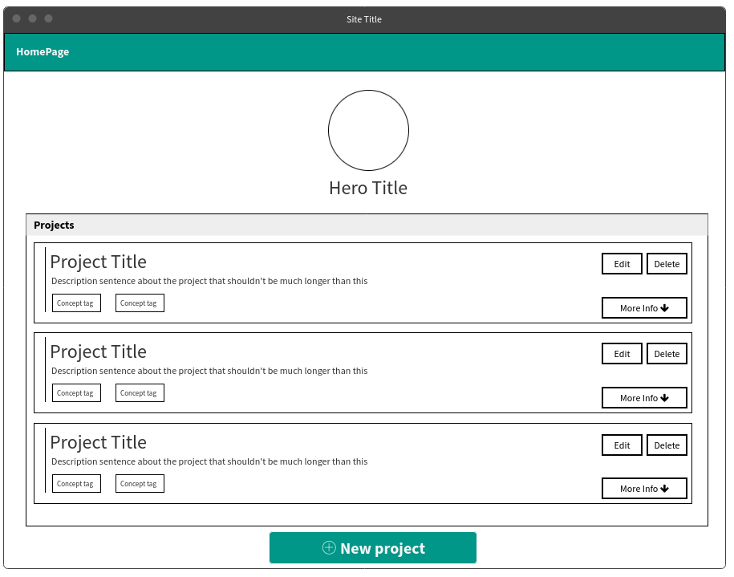

Vue Project Manager
===================

## Description

Vue Project Manager is my way to both showcase and organize what I'm doing.
In this (rather long) post, I intend to document all the thought process to create the app: my first ideas, requirement definition, design benchmark, screen prototype and final product.

## Source Code

Check the project [on GitHub](https://github.com/cdpaiva/vue-project-manager).
Feel free to change it, test it or break it.
Feedback and ideas are always very much appreciated.

A live version can be seen [in here](https://comfy-kataifi-76e8cd.netlify.app/#/).
The DB might take some time to connect, since it is hosted on [Glitch](https://glitch.com/edit/#!/light-fantastic-mask?path=db.json%3A1%3A0).

## Motivation

Goal: Do not let new ideas go and do not let old ideas be forgotten

These are my first sketches on creating an app to track the projects I am currently building and also ideas of projects that I'd like to do in the future.
The projects I currently create are focused on practicing different aspects of front-end technologies.
Based on the idea of tracking what I create and what I practice by creating it, there should be two main features in this app:

1. Add project ideas
2. Create a kanban board to each project idea

To simplify things, in the first moment, I'm going to work with mocked data (a simple data.json file) and no back-end integration with.
I'll just work on the front-end of the app.

The initial page should be a list of project ideas, where each idea can be displayed in a horizontal rectangular card.
Cards will only have the idea title, an one-sentence description and a status.
For now status will be: untouched (draft, idea) or in progress (hatching, developing).
Later on, I'm thinking about generating a percentual of work done based on the kanban board of each project.
There will be a hero in the top of the page, with user information and a button, to insert new projects.
Each project card will have a nested component, this will allow the user to expand the card and check description and notes about that project idea.

The kanban board of each project will have 3 columns: TO-DO, IN PROGRESS and DONE.
It will also be possible to perform basic operations on each task: create, edit, and delete.
The creation of tasks will be possible in whichever column we desire.
Tasks will also have a button, to be promoted to the next column once that stage is completed.

The whole system will be at first designed for a single user.

What I expect for this application:
- As a tool to commit myself into my ideas and to organize them
- I should be able to evaluate how much the initial idea has changed over time.
It is very easy to end up sacrificing a feature or design idea simply because it is too hard.
- I want a category of "finished" projects.
Probably I'll be returning onto them from time to time, but it'd be cool to see the ideas that were brought to life.
- Since I'll be using these projects to practice concepts, each project should have a list of tags, that are the concepts practiced.

Technologies/apps used:
- Vue.js
- Tailwind.css
- MockFlow for the prototypes

For the future (Not initial scope):
- Insert statistics and dashboards of the projects in the starting page
- Create the back-end integration
- Maybe a small "self-daily" tool would be nice, for me to keep track of what I'm doing/not doing at all.
    * The "self-daily" is a collection of brief discussions with myself of what I did, what didn't went well and what to do in next iteration

## Requirements

|Requeriment number|Requeriment|
|:-----------------|:---------|
|1                 |Initial page should display a list of projects|
|2                 |Information on each project can be seen directly on the initial page|
|3                 |Each project should have a kanban board, that is displayed in another page|
|4                 |Completed projects should be marked differently|
|5                 |New projects can be added|
|6                 |Activities in the kanban board can be added in every status|
|7                 |Activities can be edited and deleted|
|8                 |The kanban board is fully functional|
|9                 |Time since last touched should be up to date|
|10                |Projects have tags of practiced concepts|

## Non functional requirements

|Requeriment number|Requeriment|
|:-----------------|:---------|
|1                 |Tech used: vue.js and tailwind.css|
|2                 |Browser view only|

## Desired features

These should be created _after_ a first version is alive.

|Requeriment number|Requeriment|
|:-----------------|:---------|
|1                 |A log of the alterations should be created|
|2                 |Visualize a dashboard of activities in the initial page|
|3                 |Generate a list of practiced concepts|
|4                 |Self-daily tool|
|5                 |Back-end integration|

## What this project does not do/does not do yet

1. No back-end connection, nor data persistance (yet)
2. No insertion of new projects and activities (yet)
3. This is not a full fledged app for project management.
It is rather a mix of projects organizer with a small tracker of each project status.
4. This is not intended to be used by multiple users.
Each user has its own projects list that is accessed only by him/her.

## Elements of Design

There are quite a few tools that already do what I want to build.
Specially for kanban boards, there are lot's of references: assana, miro, jira, monday...
The kanban design doesn't change much, and I'll end up following the classical 3 columns layout.
I just want to give an special visual weight for the add new activity button, this is something that I felt was overlooked in a few websites.

The best design for the initial page was from [ant design pro](https://preview.pro.ant.design/list/basic-list/). It is so nice that I could all functionality in the list and the page is not even in english!
Both the basic list and the card list are beautiful and functional. 
I prefered the basic list, because I think it will be easier to implement the dropdown details of each card and there is more space available to directly display information, without needing to visit the kanban board.
The modifications I want from ant design are:
* Include a list of tags in the lower part of the card
* Insert the dropdown info
* There is no need for pagination

## Prototypes

The first low fidelity is done, but it needs more work on the details of the card itself. There are no edit or remove buttons, which are a must. The dropdown option can be improved too.

Twisting a little bit the elements of each project card, I ended up with the following prototype:

## Tasks

After writing the first draft of how the app should be, I created the list of tasks.
For the next project, I'll probably use the Project Manager to create and track the tasks!
- Extract the requirements from these initial ideas
- Gather design ideas using a webdesign benchmark
- Create a low fidelity prototype
- Structure the data inside data.json
- Populate the data (3 mocked projects, with the corresponding kanban boards)
- Build the initial page
- Build the kanban page
- Add New Project page
- Add Edit Project page
- Create confirmation message in the New Project page
- Improve New Project UI (specially the list of tags)
- Create the CRUD operations for the kanban tasks -> the new task will be an overlay, displayed in the same page as the kanban board
- Add notification message for the new project and edit project page

## Changes along the way

- The `data.json` file was replaced by a `json-server` instance.
The collection had to be changed.
To ease the access to the data, I had to split the _tasks_ into a "separate" table.
There was no literal separation, since `json-server` uses a _json_ file to mock the database.
But when we set a key to the top-level of the json object, we end up with a direct route to those properties, which is an over-simplistic way to create a separate table.

- The prototype was further simplified once I had the final version. 
I ended up removing the buttons and creating just a row with the options styled as hyperlinks.

- The first version of the kanban board had buttons, so the user would click to move the button from _To Do_ to _In Progress_, for example.
After everything was working, I implemented a drag and drop functionality, which feels much better to use and was something I've never did before.
