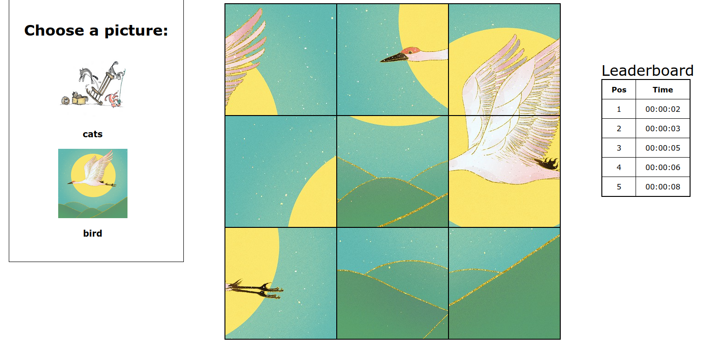

Vue Puzzle Slider
=================



## Description

Vue Slider Puzzle is an application created with Vue.js in which users can play a simple swap title game.
There are currently two images that can be picked.
Once the game starts, the selected image is sliced into a 3x3 grid and a timer starts. 
The player can swap the tiles by clicking on the first and then the second title.
Once the shuffled titles are re-organized as the original picture, the game is won.
This project is based on the Chapter 3 of the book Learn Vue.js by Example, written by John Au-Yeung.
The book's version can be found [in here](https://github.com/PacktPublishing/-Vue.js-3-By-Example/tree/master/Chapter03).
I've created a new layout, added new tests and covered a few unimplemented edge cases, that will be presented in this text.

## Source code

Check a live version of the project [in here](https://beautiful-flan-fc5c64.netlify.app/).

The code is [in here](https://github.com/cdpaiva/vue-slider-puzzle).

Feel free to change it, test it or break it.
Feedback and ideas are always very much appreciated.

## Game dynamic

The game logic is encapsulated inside the SliderPuzzle component.
The SliderPuzzle will receive a String as props, indicating the name of the puzzle selected.
This String will match the folder name containing the 9 pieces of the game.
The pieces can therefore have the same names for every puzzle, and can be treated as an array of Strings.
This is a great move, as it decouples the current image from the code.
Inserting new images is just a matter of creating a new folder with the image slices and pass that folder's name to the SliderPuzzle.

Once the user clicks Start, the clock starts and the pieces are shuffled. The shuffled pieces are stored in `shuffledPuzzleArray`, that will be manipulated according to the user clicks.
A new timer is set, which uses `setInterval()` to work as an event loop for the game.
Each second, the game is checked for a win and the `currentDateTime` is updated.
The game win is determined by the computed property `isWinning`.
Each time the `shuffledPuzzleArray` changes, `isWinning` will be auto-updated reactively to check if `shuffledPuzzleArray` matches the `correctPuzzleArray`.
This is all done by Vue, we just need to set `isWinning` as a computed property.

A click stores the slice index in the `indexesToSwap` array.
When the array has two elements, `shuffledPuzzleArray` will have the corresponding indexes swapped.
Once we define that the game is won, we clear the interval and set the timer to null.
While the game is on, two other computed properties are responsible for keeping track of the time: `elapsedDiff` and `elapsedTime`.
They use the moment.js to calculate the time difference and formatting.
There are probably other good alternatives to this, since moment.js themselves [do not recommend using it in new projects anymore](https://momentjs.com/docs/).

## High Scores

When the game is won, we'll check if the leader board should be updated.
There is no back-end integration, so the high scores will be saved locally in the client browser, in local storage.
This means that the high scores list will be saved in the web browser with no expiration date.
When I say _the client browser_, I mean the same browser and the same domain.
Opening the game in Firefox will result in different high scores than in Chrome, this is how local storage works.

## Tests

Tests use Vue Test Utils (VTU), that allows to mount components inside wrappers.
The wrappers provide valuable methods for different tests.
I want to highlight three broad use cases for the wrappers:

1. __User interactions__

We can simulate user interactions, for example, `@click` events.
For instance, before the game starts, clicking on the board shouldn't have any effects.
The test below checks this behavior:

```js
it('does not allow swap if game has not started', () =>{
    const wrapper = mount(SliderPuzzle)
    wrapper.get('.column:nth-child(1) img').trigger('click');
    expect(wrapper.vm.indexesToSwap.length).toBe(0);
})
```

First, we mount the wrapper with a SliderPuzzle component.
Keep in mind that in the initial state of SliderPuzzle, the game has not started yet.
We then trigger a click event in the first image, using a class selector.
We expect that the `indexesToSwap` array remains empty, since it should only receive values after the game starts.

2. __Check emitted events__

A nice feature of VTU is that the events emitted by the wrappers are automatically recorded, so we can easily assert our component behavior.
For example, when a user selects an image to be used in the board, the `Puzzles` component should emit an event to signal the new selected puzzle:

```js
it('emits puzzled-changed event when image is clicked', () => {
    const wrapper = mount(Puzzles)
    wrapper.find('.col img').trigger('click')
    expect(wrapper.emitted()).toHaveProperty('puzzle-changed')
})
```

3. __Create components with custom data__

When we mount a component, we can set custom data and custom computed properties.
In the next test, we want to test if the component properly determines when a game is won.
We set a wrapper with equal `correctPuzzleArray` and `shuffledPuzzleArray`, which is the condition for winning a game.

```js
it('can determine when a game is won', () => {
    wrapper = mount(SliderPuzzle, {
        data() {
        return {
            correctPuzzleArray: [
                'image_part_001.jpg','image_part_002.jpg'
            ],
            shuffledPuzzleArray: [
                'image_part_001.jpg','image_part_002.jpg'
            ]
        }
        }
    })
    expect(wrapper.vm.isWinning).toBe(true)
})
```
## Edge cases

A few improvements over the original code proposed by the book were made.
The corresponding tests were implemented and can be found in GitHub.
It's incredible how the possibilities of user interactions scale up in simple games like this.
The introduction of a time tracking also adds some complexity.
I'm sure there are several other uncovered situations that can arise in this game, but these are the improvements I got so far.

* Timer should be reset when the puzzle changes: when the `Puzzle` component emits an event to change the Puzzle, the entire game needs to be reset. This is solved by watching the puzzle received and reseting the game accordingly.
* A game should not be auto-won: this is a rather rare case, but anyways, a user should not have the chance of winning the game simply by clicking in the Start button. In other words, the `shuffle` method must assure that the `shuffledPuzzleArray` is different than the `correctPuzzleArray`. The chance of suffling the array and receiving it in the same order is `1/9!`. There is no test for this case, because it would be rather costly to compute different arrays until a collision is detected. This is solved by comparing the shuffled array to the original array before returning it.
* After a game is started, users should not be able to start another game on top of it: this generates a lot of problems. Clicking on the start button once the timer is defined will create another timer instance. Once the game is finished, more than one value is stored in the records array. This may also cause the timer to crash in other ways, for example: starting a game twice and then quiting it will cause the timer to continue running. This is solved with a boolean variable `isGameOn`, that will flag if the game is on or not.
* After winning, the board shouldn't be clickable anymore: the game should be completely over when a player wins. This is solved by setting `isGameOn` to `false` and by adding an overlay with the user time on top of the board.

## Code structure

The project was created using Vue CLI. Images are sliced and storing in the corresponding puzzle folder. The folder name is used to identify the puzzle, as explained in the [game dynamic](#game-dynamic). There are three components, which are all children of the App component.

* Puzzle: image selection
* SliderPuzzle: encapsulates game logic and user interaction
* Records: displays the high scores saved in localStorage