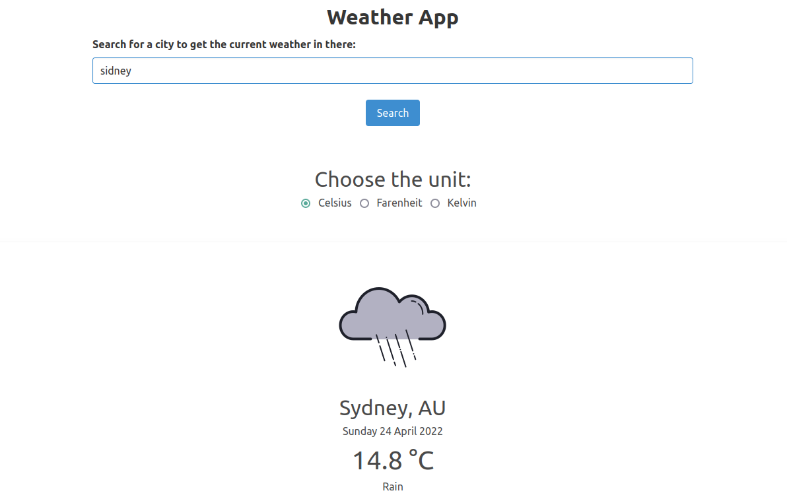

vue-weather
===========



## Description

This is a project to illustrate fetching resources from an external API, processing the responses received and displaying information based on those responses. 
It uses Vue.js with the options API as the JS framework, axios as an HTTP client and Bulma as a CSS framework.
I tried to follow the [Vue.js style guide](https://v2.vuejs.org/v2/style-guide/) throughtout the code.

## Source code

Check the project [on github](https://github.com/cdpaiva/vue-weather).
Feel free to change it, test it or break it.
Feedback and ideas are always very much appreciated.

## API Call

The API used is the Weather API of [OpenWeather](https://openweathermap.org/api).
The API is very well documented and using it is a matter of understanding how to properly build the URI with the required parameters.
There are different API calls available for the Weather API, I chose to make a request using the city name and the desired temperature unit.

The complete call is:
```
https://api.openweathermap.org/data/2.5/weather?q={city-name}&units=${unit}&appid={API key}
```
The `city-name` and the `unit` are inputs provided by the user, accessed using `v-model`, the cool vue directive that creates two-way data binding. 
More on this in the [Vue docs](https://vuejs.org/guide/essentials/forms.html).

In this case, the information is retrieved only when the user inputs a city, long after the page is created.
A very common situation is to need to fetch data right when the page loads.
We can use Vue's lifecycle hooks for this.
The data fetching can be done inside `created()`.
At this moment, the Options are read and can be modified, but the DOM is not mounted yet.
Any data initialization that does not depend on the DOM can be done here.

## API Key

The `VUE_APP_API_KEY` is required by Weather API.
Each user needs to provide a key.
The solution for that is to set an _environment variable_ when launching the app.
In linux, for example, this would be done as so:
```bash
VUE_APP_API_KEY=insert_your_key_here npm run serve
```
If the app is ran without a key, the search is disabled and the user is instructed to re-run the app with the key.
If we deployed the app, the key could be saved in production config vars, in Heroku, for example.
Environment variables are a viable way of running code locally without having to hardcode the key.

## Code structure

The project was created using Vue CLI.
The API calls are separated in the _weatherService_ file.
_App.vue_ concenters the bulk of the code.
It is responsible for fetching the search requests and to check if an API key is present.

The other components are rendered as children of App and are fairly straightforward:
- PromptForAPIKey: presents an error message if no API key is found
- Seach: get user input and emits them to make the API calls
- SearchFailed: displays messages in cases of not finding the city or errors during fetching
- WeatherDisplay: receives the API response and presents data, using the images in the _assets_ folder